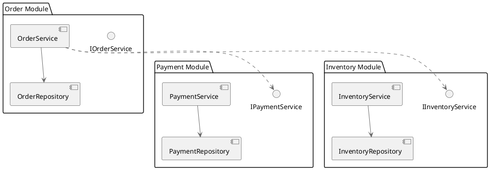

# 开发视图设计技能 (Development View Design Skill)

## 概述

开发视图描述系统的静态代码结构，包括模块、包、分层架构和模块间的依赖关系。开发视图的目的是确保代码的可维护性、可扩展性和团队并行开发的可能性。

## 核心概念

### 1. 模块 (Module)

模块是一个相对独立的、功能相关的代码集合。

**模块的特点**：
- **高内聚** (High Cohesion)：模块内的代码紧密相关
- **低耦合** (Low Coupling)：模块间的依赖最少
- **明确的边界** (Clear Boundary)：清晰定义模块的职责
- **独立可测** (Independently Testable)：模块可以独立测试

**模块分解原则**：
```
功能分解：按业务功能分解模块
  ✓ OrderModule（订单相关功能）
  ✓ PaymentModule（支付相关功能）
  ✓ InventoryModule（库存相关功能）

技术分解：按技术功能分解模块
  ✗ 避免这种方式，会导致功能分散
```

### 2. 包 (Package)

包是代码文件的逻辑组织方式，通常对应文件系统的目录结构。

**包的设计规则**：
```
命名规则：
  - 使用反向域名：com.example.ecommerce
  - 按功能层级组织：com.example.ecommerce.order.service
  - 避免过长的包名

组织原则：
  - 按领域功能分层
  - 包内类相关度高
  - 包间依赖清晰单向
```

### 3. 分层架构 (Layered Architecture)

分层架构将系统分为多个逻辑层，每层有明确的职责。

**标准的4层或5层架构**：
```
┌─────────────────────────────────┐
│   Presentation Layer            │  处理用户交互（Web, API, CLI）
├─────────────────────────────────┤
│   Application/Service Layer     │  处理应用逻辑和协调
├─────────────────────────────────┤
│   Business Logic Layer          │  处理核心业务规则
├─────────────────────────────────┤
│   Persistence/Data Access Layer │  处理数据访问（数据库、缓存）
├─────────────────────────────────┤
│   Infrastructure Layer          │  基础设施服务（日志、配置、消息队列）
└─────────────────────────────────┘
```

**各层的职责**：
- **表现层** (Presentation)：控制器、视图、数据格式转换
- **应用层** (Application)：应用流程、事务管理、协调业务逻辑
- **业务逻辑层** (Business Logic)：核心业务规则、领域模型
- **数据访问层** (Data Access)：数据库操作、ORM映射
- **基础设施层** (Infrastructure)：系统级服务、工具类

### 4. 依赖关系 (Dependencies)

明确的、单向的依赖关系对于代码的可维护性至关重要。

**依赖原则**：
```
上层可以依赖下层，但下层不能依赖上层
上层与上层不应该有依赖，应该通过接口通信

表现层
  ↓ (依赖)
应用层
  ↓ (依赖)
业务逻辑层
  ↓ (依赖)
数据访问层 + 基础设施层
```

**避免的问题**：
```
❌ 循环依赖：A依赖B，B又依赖A
❌ 跨越多层的依赖：表现层直接依赖数据访问层
❌ 下层依赖上层：数据访问层依赖表现层
```

## 设计流程

### Step 1：分析逻辑视图中的类

从逻辑视图开始，列出所有的类，并分析它们的功能类别。

**分类示例 - 电商系统的类**：
```
核心领域模型：
  - Order, OrderItem, Product
  - User, Payment, Inventory

服务类：
  - OrderService, PaymentService, InventoryService
  - UserService, SearchService

仓储类：
  - OrderRepository, ProductRepository
  - UserRepository, PaymentRepository

值对象：
  - Money, Address, OrderStatus

DTO/数据传输对象：
  - CreateOrderRequest, OrderResponse
  - ProductDTO, UserDTO
```

### Step 2：识别功能领域和模块

将相关的类分组为功能模块。

**模块划分标准**：
1. **业务对齐** - 按业务领域划分
2. **高内聚** - 模块内的类紧密相关
3. **低耦合** - 模块间的依赖最少
4. **独立可测** - 模块能单独测试

**示例 - 电商系统的模块**：
```
OrderModule：
  - Order, OrderItem, OrderStatus
  - OrderService, OrderRepository
  - CreateOrderRequest, OrderResponse

PaymentModule：
  - Payment, PaymentStatus
  - PaymentService, PaymentRepository
  - PaymentRequest, PaymentResponse

InventoryModule：
  - Product, Stock, Inventory
  - InventoryService, InventoryRepository
  - StockReservation, StockRelease

UserModule：
  - User, UserProfile
  - UserService, UserRepository
  - UserRegistrationRequest, UserResponse

CommonModule：
  - Money, Address
  - PageQuery, PageResult
  - 异常定义，常数定义
```

### Step 3：设计分层结构

确定系统采用的分层方式，并将类分配到各层。

**分层设计示例**：
```
表现层 (API Controllers):
  - OrderController
  - PaymentController
  - InventoryController
  - UserController

应用服务层 (Application Services):
  - PlaceOrderApplicationService
  - ProcessPaymentApplicationService
  - QueryOrderApplicationService

业务逻辑层 (Domain Layer):
  - Order (Aggregate Root)
  - OrderItem, OrderStatus
  - Payment, PaymentStatus
  - Product, Inventory

仓储层 (Data Access):
  - OrderRepository
  - PaymentRepository
  - ProductRepository

基础设施层:
  - PaymentGatewayAdapter
  - MessageQueueClient
  - CacheService
  - LoggingService
```

### Step 4：定义包结构

基于模块和分层，设计具体的包结构。

**包结构设计方式**：

**方式1：按功能领域组织（推荐）**：
```
com.example.ecommerce
├── order/                           # 订单模块
│   ├── domain/                      # 业务逻辑层
│   │   ├── Order.java
│   │   ├── OrderItem.java
│   │   ├── OrderStatus.java
│   │   └── OrderRepository.java
│   ├── application/                 # 应用层
│   │   ├── PlaceOrderService.java
│   │   ├── CreateOrderRequest.java
│   │   └── OrderResponse.java
│   ├── infrastructure/              # 基础设施层
│   │   └── JpaOrderRepository.java
│   └── api/                         # 表现层
│       └── OrderController.java
│
├── payment/                         # 支付模块
│   ├── domain/
│   ├── application/
│   ├── infrastructure/
│   └── api/
│
├── common/                          # 共用
│   ├── domain/
│   │   ├── Money.java
│   │   ├── Address.java
│   │   └── BaseEntity.java
│   ├── exception/
│   │   ├── BusinessException.java
│   │   └── SystemException.java
│   ├── constant/
│   │   └── Constants.java
│   └── util/
│       └── DateUtil.java
└── config/                          # 配置
    └── ApplicationConfig.java
```

**方式2：按技术分层组织**：
```
com.example.ecommerce
├── api/                             # 表现层
│   ├── OrderController.java
│   ├── PaymentController.java
│   └── request/response/
│
├── service/                         # 应用/业务服务层
│   ├── OrderService.java
│   ├── PaymentService.java
│   ├── InventoryService.java
│   └── impl/
│
├── domain/                          # 业务逻辑层
│   ├── Order.java
│   ├── Payment.java
│   ├── Product.java
│   └── ...
│
├── repository/                      # 数据访问层
│   ├── OrderRepository.java
│   ├── PaymentRepository.java
│   └── ...
│
├── infrastructure/                  # 基础设施层
│   ├── PaymentGatewayAdapter.java
│   ├── MessageQueueClient.java
│   └── ...
│
└── common/
    ├── exception/
    ├── constant/
    └── util/
```

**推荐使用方式1**：
- 更好地体现模块边界
- 便于团队按模块并行开发
- 模块迁移和维护更容易
- 更符合DDD（领域驱动设计）的思想

### Step 5：定义模块间的通信

明确模块之间如何交互。

**模块通信方式**：

**方式1：通过接口**：
```java
// OrderModule 中的接口
package com.example.ecommerce.order.application;

public interface InventoryService {
    void reserveInventory(Long productId, int quantity);
    void releaseInventory(Long productId, int quantity);
}

// PaymentModule 实现 InventoryService
package com.example.ecommerce.inventory.application;

@Service
public class InventoryServiceImpl implements InventoryService {
    // 实现
}
```

**方式2：通过事件**：
```java
// OrderModule 发布订单创建事件
class PlaceOrderService {
    public void placeOrder(CreateOrderRequest request) {
        Order order = Order.create(...);
        eventPublisher.publish(new OrderCreatedEvent(order));
    }
}

// InventoryModule 订阅事件
@Service
public class OrderEventListener {
    @EventListener
    public void onOrderCreated(OrderCreatedEvent event) {
        inventoryService.reserveInventory(
            event.getProductId(),
            event.getQuantity()
        );
    }
}
```

**方式3：通过数据库**：
```
Order 表 ──> Inventory 表
（最后的选择，会增加耦合度）
```

### Step 6：验证依赖关系

检查是否存在循环依赖、跨越多层的依赖等问题。

**依赖检查清单**：
```
□ 是否有模块间的循环依赖？
□ 是否有下层模块依赖上层模块？
□ 是否有跨越多层的直接依赖？
□ 模块接口是否清晰？
□ 模块间是否通过接口而不是实现通信？
```

### Step 7：创建开发视图图表

使用PlantUML绘制组件图和包图。

**PlantUML组件图示例**：


## 常见的分层模式

### 1. DDD分层

```
┌─────────────────────────────────┐
│   User Interface Layer          │  用户界面
├─────────────────────────────────┤
│   Application Service Layer     │  应用服务
├─────────────────────────────────┤
│   Domain Layer                  │  域模型
├─────────────────────────────────┤
│   Infrastructure Layer          │  基础设施
└─────────────────────────────────┘
```

### 2. 整洁架构

```
┌───────────────────────────────┐
│  Controllers / Gateways       │
├───────────────────────────────┤
│  Use Cases / Interactors      │
├───────────────────────────────┤
│  Entities / Business Rules    │
├───────────────────────────────┤
│  Frameworks & Drivers         │
└───────────────────────────────┘
```

## 最佳实践

### DO's ✅

1. **按业务功能组织包**
   - 使用反向域名命名
   - 包名反映功能职责
   - 相关的类放在同一包中

2. **保持分层清晰**
   - 每层有明确的职责
   - 上层只依赖下层
   - 避免分层混乱

3. **最小化模块间依赖**
   - 通过接口通信
   - 使用事件解耦
   - 隐藏内部实现

4. **支持并行开发**
   - 模块边界清晰
   - 团队可独立开发
   - 集成点明确

### DON'Ts ❌

1. ❌ **过度细粒度**
   - 不要创建过多的包
   - 不要让包层次过深（>4层）
   - 保持结构简洁

2. ❌ **混乱的分层**
   - 不要跨层直接依赖
   - 不要在多个层混合业务逻辑
   - 不要让层的职责不清晰

3. ❌ **循环依赖**
   - 不要让模块相互依赖
   - 使用接口和事件打破循环
   - 定期检查依赖关系

4. ❌ **按技术分层**
   - 不要只按Controller/Service/Repository分
   - 这样会导致业务功能分散
   - 难以理解整个业务流程

## 模块边界定义

### 订单模块的边界

**内部**：
- Order（聚合根）
- OrderItem, OrderStatus
- OrderRepository
- OrderService
- CreateOrderRequest, OrderResponse

**对外接口**：
```java
public interface IOrderService {
    OrderResponse createOrder(CreateOrderRequest request);
    OrderResponse getOrder(Long orderId);
    void confirmPayment(Long orderId, Payment payment);
    void cancelOrder(Long orderId);
}
```

**对外事件**：
```java
public abstract class DomainEvent {
    public final long aggregateId;
    public final LocalDateTime occurredAt;
}

public class OrderCreatedEvent extends DomainEvent {
    public final OrderId orderId;
    public final UserId userId;
    public final List<OrderItem> items;
}

public class OrderPaidEvent extends DomainEvent {
    public final OrderId orderId;
    public final Money amount;
}
```

**对外依赖**：
- IPaymentService（支付模块）
- IInventoryService（库存模块）

## 开发视图验证清单

开发视图设计完成后，验证以下内容：

- [ ] **模块划分合理** - 每个模块有明确的职责
- [ ] **包结构清晰** - 包的层次结构易于理解
- [ ] **分层清晰** - 各层的职责清晰划分
- [ ] **依赖单向** - 依赖关系是单向的
- [ ] **无循环依赖** - 没有模块间的循环依赖
- [ ] **高内聚** - 模块内部的类关系紧密
- [ ] **低耦合** - 模块间的耦合最小
- [ ] **易于测试** - 模块易于独立测试
- [ ] **图表规范** - 组件图和包图符合规范
- [ ] **逻辑视图支持** - 所有逻辑视图的类都被包含
- [ ] **模块通信** - 模块间的通信方式清晰
- [ ] **可扩展性** - 设计支持未来的功能扩展

## 参考资源

- `docs/4plus1-plugin-implementation-plan.md` - 实施计划
- `agents/development-view-architect.md` - 开发视图架构师Agent
- `skills/logical-view-design/SKILL.md` - 逻辑视图设计
- `skills/plantuml-best-practices/SKILL.md` - PlantUML最佳实践
- `assets/examples/ecommerce-system/3-development-view.plantuml` - 电商平台开发视图示例

---

开发视图是确保代码长期可维护性的关键，务必在项目初期认真设计，这样将大大降低后期的维护成本。
