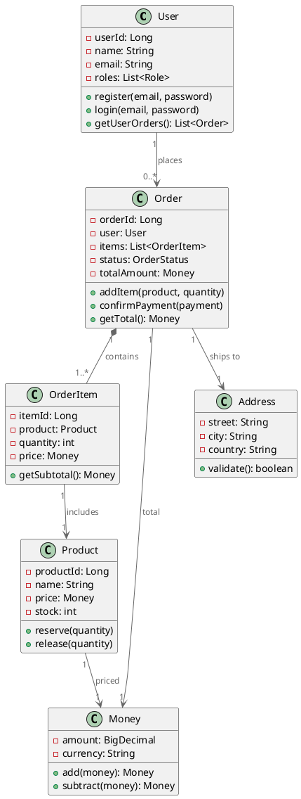

# 逻辑视图设计技能 (Logical View Design Skill)

## 概述

逻辑视图是系统的功能分解视图，描述系统的类、对象、接口和它们之间的关系。逻辑视图直接由场景视图驱动，确保系统的类和对象能够支持所有的用例和场景。

## 核心概念

### 1. 领域模型 (Domain Model)

领域模型是用来表示业务领域的对象模型。它包含所有关键的业务概念和它们之间的关系。

**领域模型的三个层次**：
1. **实体 (Entity)**：具有唯一标识，生命周期长
   ```
   示例：User, Product, Order
   特征：有主键，可追踪，状态会改变
   ```

2. **值对象 (Value Object)**：没有唯一标识，通过值来比较
   ```
   示例：Money, Address, Color
   特征：不可变，无标识，只关心值
   ```

3. **聚合 (Aggregate)**：一组相关的对象构成的整体
   ```
   示例：Order是一个聚合，包含OrderItem等
   特征：有边界，内部保持一致性
   ```

### 2. 类的职责分类

在逻辑视图设计中，类通常分为以下几类：

**实体类 (Entity)**：
```java
public class Order {
    private Long orderId;
    private User user;
    private List<OrderItem> items;
    private OrderStatus status;

    public void addItem(Product product, int quantity) { }
    public void confirmPayment(Payment payment) { }
}
```

**服务类 (Service)**：
```java
public class OrderService {
    public Order createOrder(User user, List<Product> products) { }
    public void processPayment(Order order, Payment payment) { }
}
```

**值对象 (Value Object)**：
```java
public class Money {
    private BigDecimal amount;
    private Currency currency;

    public Money add(Money other) { }
    public Money multiply(BigDecimal factor) { }
}
```

### 3. 类的关系

**关联 (Association)**：
```
Order ──────→ User
  "placed by"
（一个订单由一个用户创建，一个用户可以有多个订单）
```

**聚合 (Aggregation)**：
```
Order ◇──────→ OrderItem
  "contains"
（Order包含OrderItem，但OrderItem可以独立存在）
```

**组合 (Composition)**：
```
Order ⬥──────→ Address
  "has"
（Address是Order的一部分，Order删除时Address也删除）
```

### 4. SOLID原则在逻辑视图中的应用

**S - 单一职责原则**：
```
❌ 错误：一个Order类处理订单、支付、发货、库存等
✅ 正确：Order只负责订单数据，支付交给PaymentService
```

**O - 开闭原则**：
```
✅ 通过接口定义业务规则：
   interface DiscountStrategy {
       Money calculate(Order order);
   }

   class StudentDiscount implements DiscountStrategy { }
   class LoyaltyDiscount implements DiscountStrategy { }
```

**L - 里氏替换原则**：
```
interface Repository<T> {
    T findById(Long id);
    void save(T entity);
}

// UserRepository和OrderRepository都能替换Repository
```

**I - 接口隔离原则**：
```
❌ 错误：一个大接口包含所有方法
interface UserService {
    User register();
    void login();
    void logout();
    void pay();    // 不是所有用户都支付
}

✅ 正确：分离职责
interface AuthService {
    User register();
    void login();
}
interface PaymentService {
    void pay();
}
```

**D - 依赖倒转原则**：
```
✅ 依赖抽象而不是具体实现
class OrderService {
    private Repository<Order> repository;  // 依赖抽象

    public OrderService(Repository<Order> repository) {
        this.repository = repository;
    }
}
```

## 设计流程

### Step 1：从场景视图提取名词

从用例的文本描述中识别所有的名词，这些是可能的业务对象。

**电商下单用例中的名词**：
```
用例文本：
"消费者进入购物车，查看商品清单。消费者输入收货地址，
选择配送方式。系统计算运费。消费者查看订单总额。
消费者确认订单，系统创建订单，预扣库存。"

提取的名词：
- 消费者 → User/Consumer
- 购物车 → ShoppingCart
- 商品 → Product
- 清单 → CartItem
- 收货地址 → Address
- 配送方式 → DeliveryMethod
- 运费 → ShippingFee
- 订单总额 → Money
- 订单 → Order
- 库存 → Inventory
```

### Step 2：分类和整理对象

将提取的对象分类，识别关键的业务对象。

**分类示例**：
```
实体对象：
  - User/Consumer（消费者）
  - Product（商品）
  - Order（订单）
  - Payment（支付）

值对象：
  - Money（金额）
  - Address（地址）
  - DeliveryMethod（配送方式）

关联对象：
  - ShoppingCart（购物车）
  - OrderItem（订单项）
```

### Step 3：为每个对象定义属性

分析对象的数据结构，确定关键属性。

**属性设计要点**：
- 识别对象的身份标识（ID）
- 列出关键属性
- 定义属性的类型
- 指定属性的约束

**示例 - Order的属性**：
```
@Entity
public class Order {
    // 身份标识
    @Id
    private Long orderId;

    // 关键属性
    private Long userId;              // 谁创建的订单
    private List<OrderItem> items;    // 订单包含哪些商品
    private Money totalAmount;        // 订单总金额
    private OrderStatus status;       // 订单状态
    private Address shippingAddress;  // 配送地址

    // 跟踪属性
    private LocalDateTime createdTime;
    private LocalDateTime updatedTime;

    // 业务属性
    private Money discount;           // 优惠金额
    private Money shippingFee;        // 运费
}
```

### Step 4：为每个对象定义行为（方法）

分析对象在场景中的行为，定义相应的方法。

**从场景提取行为**：
```
场景步骤：
  1. 消费者添加商品到购物车
     → ShoppingCart.addItem(Product, quantity)

  2. 消费者提交订单
     → ShoppingCart.checkout()

  3. 系统创建订单
     → Order.create(ShoppingCart)

  4. 系统预扣库存
     → Order.reserveInventory()

  5. 消费者确认支付
     → Order.confirmPayment(Payment)
```

**方法设计模板**：
```java
public class Order {
    // 创建阶段
    public static Order create(User user, List<OrderItem> items) {
        Order order = new Order();
        order.user = user;
        order.items = items;
        order.status = OrderStatus.PENDING_PAYMENT;
        order.createdTime = LocalDateTime.now();
        return order;
    }

    // 修改阶段
    public void addItem(OrderItem item) {
        if (status != OrderStatus.PENDING_PAYMENT) {
            throw new IllegalStateException("只能在待支付状态下添加商品");
        }
        items.add(item);
        recalculateTotal();
    }

    public void applyDiscount(Money discount) {
        if (discount.greaterThan(totalAmount)) {
            throw new IllegalArgumentException("折扣不能大于总金额");
        }
        this.discount = discount;
    }

    // 业务操作
    public void confirmPayment(Payment payment) {
        if (status != OrderStatus.PENDING_PAYMENT) {
            throw new IllegalStateException("订单不在待支付状态");
        }
        if (!payment.getAmount().equals(totalAmount.subtract(discount))) {
            throw new IllegalArgumentException("支付金额不匹配");
        }
        this.status = OrderStatus.PAID;
    }

    // 查询方法
    public boolean canBeCancelled() {
        return status == OrderStatus.PENDING_PAYMENT;
    }

    public Money getTotalAmount() {
        return totalAmount.subtract(discount);
    }
}
```

### Step 5：定义对象间的关系

分析对象之间的关系，确定关联类型和多重性。

**关系识别方法**：
```
问题：
  1. 对象之间是否有强制的包含关系？
     是 → 使用组合
     否 → 是否有归属关系？
       是 → 使用聚合
       否 → 使用关联

  2. 多重性是什么？
     一对一、一对多、多对多？

示例分析：
  Order - OrderItem：组合（一对多）
    Order删除时，OrderItem也要删除
  Order - User：关联（多对一）
    User删除不影响Order，保留订单历史
  Order - Payment：聚合（一对一）
    Payment独立存在，但属于Order
```

**关系定义示例**：
```
@Entity
public class Order {
    // 多对一关联：Order belongs to User
    @ManyToOne
    @JoinColumn(name = "user_id")
    private User user;

    // 一对多组合：Order contains OrderItems
    @OneToMany(mappedBy = "order", cascade = CascadeType.ALL)
    private List<OrderItem> items;

    // 值对象：Order has Address
    @Embedded
    private Address shippingAddress;
}
```

### Step 6：设计类的继承层次

确定是否需要使用继承，以及如何设计继承结构。

**继承设计原则**：
- 优先使用组合而不是继承
- 继承表示"是一个"的关系
- 基类应该是抽象的概念

**示例**：
```
❌ 错误继承设计：
class User {}
class Consumer extends User {}     // 是不是User的子类？
class Merchant extends User {}

✅ 正确设计：
class User {
    private Long id;
    private String name;
    private List<Role> roles;  // 用组合而不是继承
}

enum Role {
    CONSUMER, MERCHANT, ADMIN
}
```

### Step 7：创建类图

使用PlantUML绘制完整的类图，包括类、属性、方法和关系。

**PlantUML类图模板**：


## 最佳实践

### DO's ✅

1. **从用例出发**
   - 确保类能够支持所有用例
   - 每个场景步骤都映射到类的方法
   - 定期验证与场景的对齐

2. **保护对象的不变性**
   - 定义对象的约束条件
   - 在方法中验证约束
   - 使用异常拒绝无效操作

3. **使用值对象简化设计**
   - Money, Address等常用值对象
   - 减少基本类型的使用
   - 集中业务逻辑

4. **明确的接口设计**
   - 清晰的公开接口
   - 隐藏内部实现细节
   - 使用接口定义协约

### DON'Ts ❌

1. ❌ **贫血模型**
   - 不要创建只有getter/setter的类
   - 业务逻辑应该在对象中
   - 避免anemic domain model

2. ❌ **过度设计**
   - 不要为不存在的需求设计
   - 不要过度使用设计模式
   - 保持设计简洁

3. ❌ **混乱的关系**
   - 避免循环引用
   - 避免过深的继承层次
   - 清晰的依赖方向

4. ❌ **忽视对象的生命周期**
   - 不要忽视对象状态的转变
   - 定义明确的状态转换规则
   - 处理所有可能的状态

## 常见设计模式

### 1. 策略模式 - 处理多种算法

```java
// 优惠策略
interface DiscountStrategy {
    Money calculate(Order order);
}

class StudentDiscount implements DiscountStrategy {
    @Override
    public Money calculate(Order order) {
        return order.getTotal().multiply(0.1);  // 10% off
    }
}

class LoyaltyDiscount implements DiscountStrategy {
    @Override
    public Money calculate(Order order) {
        // 根据用户的忠诚度计算
    }
}

// 使用
class Order {
    private DiscountStrategy discountStrategy;

    public void applyDiscount(DiscountStrategy strategy) {
        this.discountStrategy = strategy;
        this.discount = strategy.calculate(this);
    }
}
```

### 2. 工厂模式 - 创建复杂对象

```java
class OrderFactory {
    public static Order createFromShoppingCart(ShoppingCart cart) {
        Order order = new Order();
        order.setUser(cart.getUser());

        for (CartItem item : cart.getItems()) {
            OrderItem orderItem = new OrderItem(
                item.getProduct(),
                item.getQuantity(),
                item.getProduct().getPrice()
            );
            order.addItem(orderItem);
        }

        order.setStatus(OrderStatus.PENDING_PAYMENT);
        return order;
    }
}
```

### 3. 观察者模式 - 事件通知

```java
interface OrderObserver {
    void onOrderCreated(Order order);
    void onOrderPaid(Order order);
    void onOrderShipped(Order order);
}

class Order {
    private List<OrderObserver> observers = new ArrayList<>();

    public void addObserver(OrderObserver observer) {
        observers.add(observer);
    }

    public void confirmPayment(Payment payment) {
        // ... 确认支付 ...
        this.status = OrderStatus.PAID;

        // 通知所有观察者
        for (OrderObserver observer : observers) {
            observer.onOrderPaid(this);
        }
    }
}
```

## 逻辑视图验证清单

逻辑视图设计完成后，验证以下内容：

- [ ] **对象完整** - 所有关键业务对象都已识别
- [ ] **属性清晰** - 每个类的属性都有明确定义
- [ ] **方法完整** - 每个类的方法支持其职责
- [ ] **关系合理** - 类间关系正确表达
- [ ] **职责单一** - 每个类只有一个职责
- [ ] **约束明确** - 不变性约束清晰定义
- [ ] **接口清晰** - 公开接口定义明确
- [ ] **生命周期** - 对象的状态转变清晰
- [ ] **图表规范** - 类图符合PlantUML规范
- [ ] **用例支持** - 所有用例都能被支持
- [ ] **SOLID原则** - 遵循SOLID设计原则
- [ ] **无循环依赖** - 没有类间的循环依赖

## 参考资源

- `docs/4plus1-plugin-implementation-plan.md` - 实施计划
- `agents/logical-view-architect.md` - 逻辑视图架构师Agent
- `skills/scenario-view-design/SKILL.md` - 场景视图设计
- `skills/plantuml-best-practices/SKILL.md` - PlantUML最佳实践
- `assets/examples/ecommerce-system/2-logical-view.plantuml` - 电商平台类图示例

---

逻辑视图是系统功能的核心表现，务必确保类的设计既能满足业务需求，又能支持后续的技术实现。
