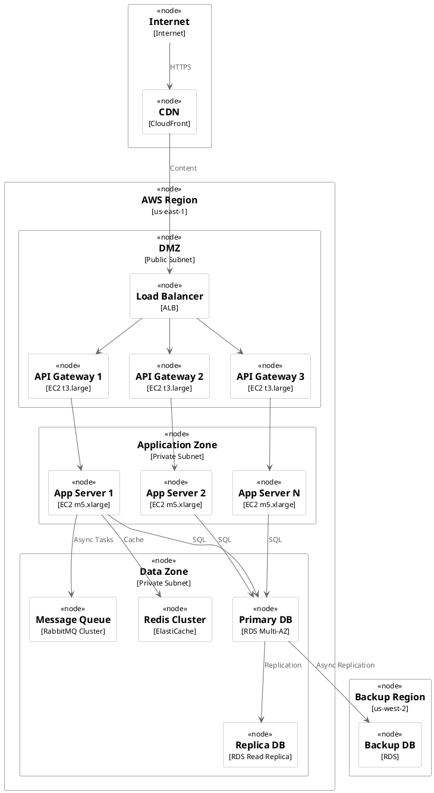

# 物理视图设计技能 (Physical View Design Skill)

## 概述

物理视图描述系统在生产环境中的部署方式，包括物理节点、网络拓扑、存储、高可用设计等。物理视图确保系统在实际环境中能够可靠地运行，并满足性能、可用性等要求。

## 核心概念

### 1. 部署单元 (Deployment Unit)

物理视图中的基本组成单位。

**常见的部署单元**：
```
Web服务器 / API网关
  - 处理HTTP请求
  - 负责路由和限流

应用服务器
  - 运行业务逻辑
  - 状态管理
  - 连接管理

数据库
  - 持久化数据
  - 事务处理

缓存服务
  - 提升性能
  - 减少数据库负载

消息队列
  - 异步处理
  - 解耦系统

定时任务服务
  - 后台处理
  - 数据同步
```

### 2. 高可用设计 (High Availability)

确保系统在部分组件故障时仍然可用。

**高可用的核心概念**：
```
无单点故障 (SPOF - Single Point Of Failure)：
  - 每个关键组件都有备份
  - 故障时自动转移
  - 保持数据一致性

可用性级别：
  - 99%：年停机时间 87.6小时 (不可接受)
  - 99.9%：年停机时间 8.76小时 (可接受)
  - 99.95%：年停机时间 4.38小时 (良好)
  - 99.99%：年停机时间 52分钟 (优秀)
```

### 3. 部署拓扑 (Deployment Topology)

系统各个部署单元的物理位置和网络连接。

**典型的分层拓扑**：
```
                    CDN / WAF
                      ↓
┌─────────────────────────────────────┐
│  负载均衡器                         │ 公网
└────────────────────┬────────────────┘
                     │
    ┌────────────────┼────────────────┐
    │                │                │
┌───▼────┐      ┌───▼────┐      ┌───▼────┐
│ API网关 │      │API网关 │      │API网关 │ DMZ
└───┬────┘      └───┬────┘      └───┬────┘
    │                │                │
    └────────────────┼────────────────┘
                     │
    ┌────────────────┼────────────────┐
    │                │                │
┌───▼────────┐  ┌───▼────────┐  ┌───▼────────┐
│应用服务器1 │  │应用服务器2 │  │应用服务器N │ 应用区
└───┬────────┘  └───┬────────┘  └───┬────────┘
    │                │                │
    └────────────────┼────────────────┘
                     │
        ┌────────────┼────────────┐
        │            │            │
    ┌───▼───┐   ┌───▼────┐   ┌───▼────┐
    │ 主库  │   │缓存    │   │消息队列│ 数据区
    └───┬───┘   └────────┘   └────────┘
        │
    ┌───▼───┐   ┌──────┐
    │ 从库  │   │从库  │
    └───────┘   └──────┘
```

### 4. 数据一致性和备份

确保数据的安全和一致性。

**主要策略**：
```
实时复制：
  主库 → 从库（强一致性）
  从库 → 从库（读写分离）

定期备份：
  完全备份 + 增量备份
  异地备份（灾备）

恢复策略：
  RTO（恢复时间目标）：多久恢复服务
  RPO（恢复点目标）：最多丢失多少数据
```

## 设计流程

### Step 1：分析部署需求

基于开发视图和进程视图的设计，确定部署需求。

**部署需求分析清单**：
```
1. 需要部署哪些组件？
   - Web前端 / API网关
   - 应用服务器
   - 数据库
   - 缓存
   - 消息队列
   - ...

2. 每个组件的规格？
   - CPU核心数
   - 内存大小
   - 存储容量
   - 网络带宽

3. 每个组件需要多少个副本？
   - 基于可用性需求
   - 基于性能需求
   - 考虑故障转移时间

4. 组件间的依赖关系？
   - 哪些组件必须同时启动
   - 部署顺序

示例 - 电商平台：
API网关：
  - 实例数：3（三副本保证可用性）
  - 规格：2C4G（CPU 2核，内存4GB）
  - 存储：100GB

应用服务器（订单服务）：
  - 实例数：10（高并发）
  - 规格：4C8G
  - 存储：50GB

数据库：
  - 实例数：1主2从
  - 规格：8C16G + 500GB SSD
  - 备份：每天一次全量 + 每小时增量

缓存：
  - 实例数：2（集群模式）
  - 规格：2C4G + 100GB
  - 数据政策：LRU淘汰

消息队列：
  - 实例数：3（集群模式）
  - 规格：2C4G
  - 持久化：开启，防止丢消息
```

### Step 2：设计网络拓扑

规划系统的网络结构和安全防护。

**网络设计要点**：
```
DMZ区域（非军事区）：
  - 放置API网关、负载均衡器
  - 可以访问互联网
  - 不能直接访问数据库

应用区域：
  - 放置应用服务器
  - 不对互联网暴露
  - 可以访问数据库和缓存

数据库区域：
  - 只有应用服务器可以访问
  - 禁止直接的互联网访问
  - 定期备份

管理区域：
  - 运维和监控服务器
  - 不对互联网暴露
  - 需要VPN访问
```

**防火墙规则示例**：
```
DMZ → 应用区：允许特定的应用服务器
应用区 → 数据库区：允许数据库连接（3306/5432）
应用区 → 缓存：允许缓存连接（6379）
应用区 → 消息队列：允许MQ连接（5672/9092）
互联网 → DMZ：允许HTTP/HTTPS (80/443)
互联网 → 应用区：禁止
互联网 → 数据库区：禁止
```

### Step 3：选择部署技术

根据需求选择合适的部署技术和云平台。

**部署技术对比**：

**1. 虚拟机（IaaS）**：
```
优点：
  - 完全控制
  - 性能好
  - 没有供应商锁定

缺点：
  - 管理复杂
  - 扩展慢
  - 资源利用率低

适用场景：
  - 对性能有特殊要求
  - 需要完全的系统控制
  - 稳定性要求极高
```

**2. 容器 + 编排（Kubernetes）**：
```
优点：
  - 自动扩展
  - 高效利用资源
  - 简化部署

缺点：
  - 学习成本高
  - 运维复杂
  - 性能开销（相对）

适用场景：
  - 微服务架构
  - 需要频繁部署
  - 流量变化大
```

**3. 无服务器（Serverless）**：
```
优点：
  - 完全自动化
  - 按使用付费
  - 0维护

缺点：
  - 成本可能高
  - 冷启动延迟
  - 供应商锁定

适用场景：
  - 流量不稳定
  - 简单的业务逻辑
  - 不需要实时性
```

### Step 4：设计高可用方案

为关键组件设计冗余和故障转移。

**高可用设计模式**：

**1. 数据库高可用**：
```
主从架构：
  主库 ──(同步复制)──→ 从库1
         ──(同步复制)──→ 从库2

读写分离：
  写操作 → 主库
  读操作 → 从库（负载均衡）

自动转移：
  主库故障 → 从库提升为主库（需要手动或自动检测）
```

**2. 应用服务器高可用**：
```
多实例部署：
  服务器1 ┐
  服务器2 ├─→ 负载均衡器 ─→ 客户端
  服务器3 ┘

故障转移：
  服务器1故障 → 负载均衡器检测 → 路由转向服务器2,3
```

**3. 缓存高可用**：
```
Redis集群：
  主节点1 → 从节点1
  主节点2 → 从节点2
  主节点3 → 从节点3

哨兵模式：
  哨兵1 ┐
  哨兵2 ├─→ 监控主从
  哨兵3 ┘     故障时自动转移
```

### Step 5：设计监控和告警

规划系统的监控体系。

**监控维度**：
```
基础设施监控：
  - CPU使用率
  - 内存使用率
  - 磁盘使用率
  - 网络带宽

应用监控：
  - 请求数
  - 响应时间
  - 错误率
  - 业务指标

数据库监控：
  - 查询性能
  - 连接数
  - 主从延迟
  - 锁等待

告警规则：
  - CPU > 80% 持续 5分钟
  - 错误率 > 1%
  - 响应时间 > 2秒
  - 磁盘空间 < 10%
```

**监控栈示例**：
```
数据收集：Prometheus / Telegraf
数据存储：Prometheus / InfluxDB
可视化：Grafana
告警：AlertManager
日志收集：ELK Stack / Loki
链路追踪：Jaeger / Zipkin
```

### Step 6：设计成本优化

在满足需求的前提下，控制成本。

**成本优化策略**：
```
1. 按需付费
   - 使用自动扩展
   - 高峰和低谷区分处理
   - 使用预留实例（可便宜30-40%）

2. 资源优化
   - 正确配置实例规格
   - 避免过度配置
   - 定期审查使用情况

3. 存储优化
   - 使用分级存储
   - 删除过期数据
   - 压缩大文件

4. 网络优化
   - 使用CDN加速
   - 减少跨地域流量
   - 合理设置缓存策略
```

**成本估算示例 - 电商平台（按AWS价格）**：
```
EC2 (应用服务器)：
  - 5个 t3.large：约 $150/月

RDS (数据库)：
  - 1个主 + 2个从 db.r5.large：约 $500/月

ElastiCache (缓存)：
  - 2个 cache.r5.large：约 $200/月

CloudFront (CDN)：
  - 流量成本：约 $100/月

其他 (存储、带宽等)：
  - 约 $100/月

总计：约 $1000/月
```

### Step 7：创建部署图

使用PlantUML绘制部署图。

**PlantUML部署图模板**：


## 常见部署模式

### 1. 单机部署（小型项目）

```
互联网
  ↓
单一服务器 (应用 + 数据库 + 缓存)

优点：简单，成本低
缺点：无高可用，性能有限
```

### 2. 多层部署（中等项目）

```
互联网
  ↓
负载均衡器
  ↓
应用服务器集群
  ↓
数据库主从

优点：可扩展，有基本的高可用
缺点：管理相对复杂
```

### 3. 微服务部署（大型项目）

```
互联网
  ↓
API网关 (Kong/Nginx)
  ↓
服务网格 (Istio)
  ↓
Kubernetes集群
  ├─ 订单服务
  ├─ 支付服务
  ├─ 库存服务
  └─ 用户服务
  ↓
数据库集群 + 缓存集群 + MQ集群

优点：高度可扩展，便于发展
缺点：复杂性高，运维要求高
```

## 物理视图验证清单

物理视图设计完成后，验证以下内容：

- [ ] **部署拓扑清晰** - 部署结构清晰易懂
- [ ] **无单点故障** - 所有关键组件都有冗余
- [ ] **高可用设计** - 有故障转移机制
- [ ] **网络设计合理** - 网络分层和隔离合理
- [ ] **监控完整** - 所有组件都有监控
- [ ] **可扩展** - 支持水平扩展
- [ ] **成本合理** - 成本在预算范围内
- [ ] **安全防护** - 网络和数据安全设计完善
- [ ] **图表规范** - 部署图符合规范
- [ ] **性能指标** - 性能指标能够满足需求
- [ ] **备份恢复** - 有完善的备份和恢复策略
- [ ] **灾难恢复** - 有DR和BC计划

## 参考资源

- `docs/4plus1-plugin-implementation-plan.md` - 实施计划
- `agents/physical-view-architect.md` - 物理视图架构师Agent
- `skills/plantuml-best-practices/SKILL.md` - PlantUML最佳实践
- `assets/examples/ecommerce-system/5-physical-view.plantuml` - 电商平台物理视图示例

---

物理视图设计决定了系统在生产环境中的可靠性和性能，务必充分考虑高可用、灾难恢复和成本等因素。
