# PlantUML最佳实践技能 (PlantUML Best Practices Skill)

## 概述

PlantUML是文本驱动的UML图表生成工具，使用简单的文本语法生成高质量的架构和设计图表。本技能指南提供PlantUML在4+1架构视图中的最佳实践。

## 核心概念

### 1. PlantUML的优势

**相比传统visio等工具**：
```
✅ 优势：
  - 文本驱动，便于版本控制
  - 易于团队协作和代码审查
  - 快速迭代和修改
  - 自动布局，减少调整
  - 支持多种输出格式（PNG, SVG, PDF）
  - 开源免费

❌ 劣势：
  - 学习曲线（但并不陡峭）
  - 对复杂图表的手动控制有限
  - 生成的图表样式有限
```

### 2. 支持的图表类型

**4+1架构中常用的图表**：
```
场景视图：用例图 (Use Case Diagram)
逻辑视图：类图 (Class Diagram)
开发视图：组件图 (Component Diagram)、包图 (Package Diagram)
进程视图：序列图 (Sequence Diagram)、活动图 (Activity Diagram)
物理视图：部署图 (Deployment Diagram)
其他：状态图 (State Diagram)、时序图 (Timing Diagram)
```

### 3. PlantUML的基础语法

**基本结构**：
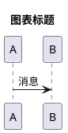

## 设计流程

### Step 1：选择合适的图表类型

根据要表达的内容选择合适的图表类型。

**选择指南**：
```
要表达          图表类型         关键要素
─────────────────────────────────────────────
用例关系        用例图          参与者、用例、系统边界
类结构关系      类图            类、属性、方法、关系
模块结构        组件图          组件、依赖、接口
包组织          包图            包、嵌套、依赖
对象交互        序列图          参与者、消息、时序
流程步骤        活动图          活动、分支、循环、同步
运行时行为      状态图          状态、转换、条件
部署物理        部署图          节点、部署单位、连接
```

### Step 2：定义基本元素

根据所选图表类型，定义基本元素。

**元素定义示例**：

**用例图**：
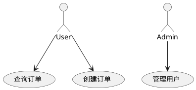

**类图**：
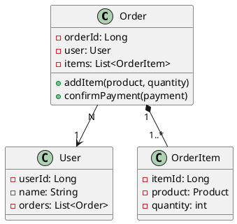

**序列图**：
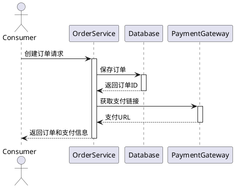

### Step 3：定义关系和连接

使用合适的连接符号表达不同的关系。

**关系符号对照表**：
```
UML关系         PlantUML语法      含义
────────────────────────────────────────
关联            -->              引用关系
聚合            o--              整体与部分
组合            *--              强依赖部分
继承            --|>             类继承
实现            ..|>             接口实现
依赖            ..>              依赖关系

多重性标注
────────────────────────────────────────
一对一          "1" --> "1"
一对多          "1" --> "*" 或 "1" --> "0..*"
多对多          "*" --> "*"
```

**关系定义示例**：
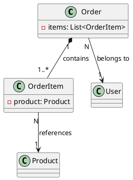

### Step 4：添加详细信息和注释

丰富图表的信息，提高可读性。

**颜色和样式**：
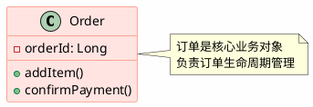

**分层和分组**：
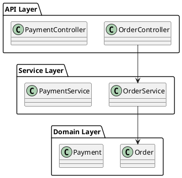

### Step 5：验证和优化

检查图表的完整性和可读性。

**验证清单**：
```
□ 所有关键元素都包含了？
□ 关系是否准确？
□ 是否清晰易读？
□ 颜色搭配是否合理？
□ 是否包含必要的注释？
□ 是否符合命名规范？
```

## 5+1架构中的PlantUML应用

### 场景视图 - 用例图

**标准模板**：
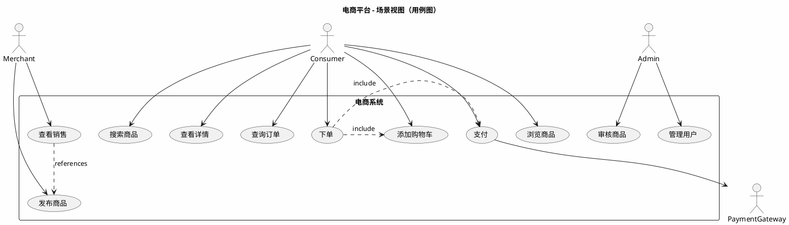

**最佳实践**：
```
✅ DO:
  - 用名词-动词结构命名用例
  - 用清晰的系统边界
  - 明确show参与者和系统的交互

❌ DON'T:
  - 过多的用例（>20个）
  - 复杂的用例间依赖
  - 模糊的用例名称
```

### 逻辑视图 - 类图

**标准模板**：
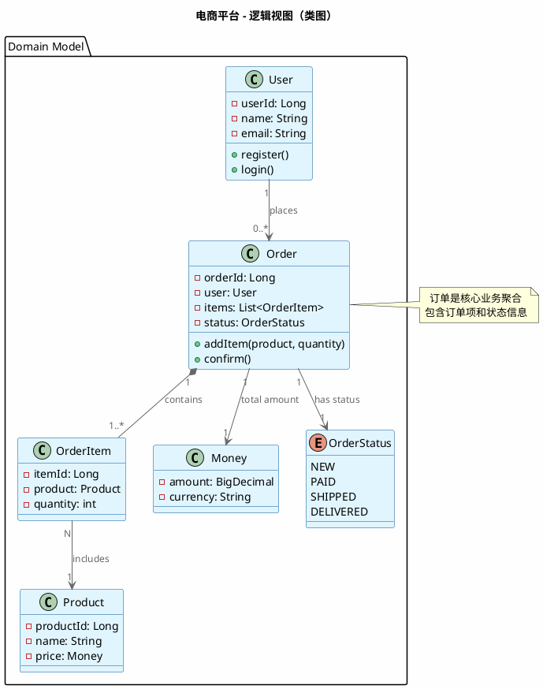

**最佳实践**：
```
✅ DO:
  - 显示关键属性和方法
  - 清晰标注多重性
  - 使用适当的关系符号
  - 分包显示

❌ DON'T:
  - 显示所有细节（类太复杂）
  - 混乱的关系（过多的连线）
  - 不标注多重性
```

### 开发视图 - 组件图

**标准模板**：
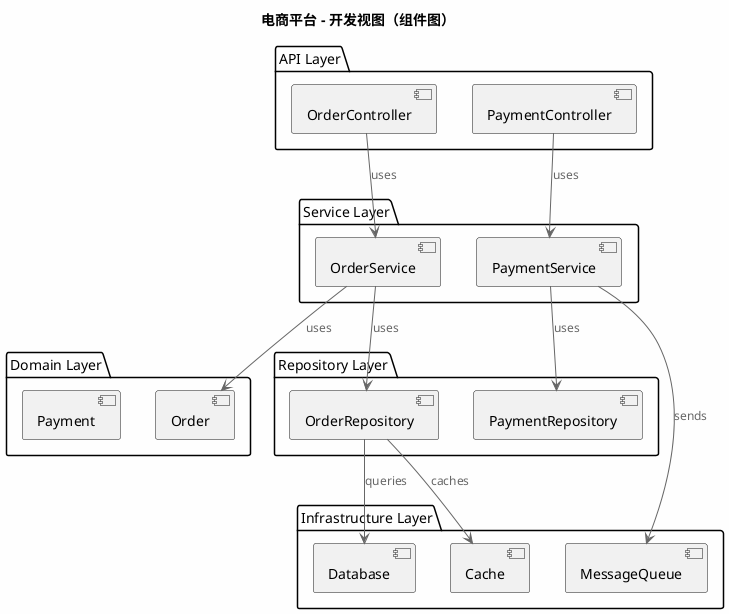

### 进程视图 - 序列图

**标准模板 - 下单场景**：
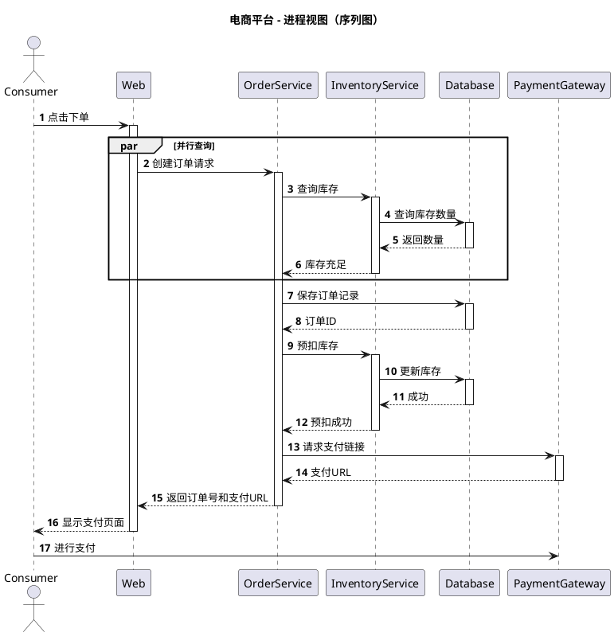

### 进程视图 - 活动图

**标准模板 - 支付流程**：
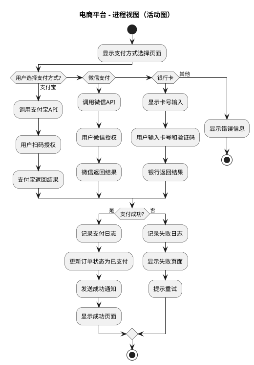

### 物理视图 - 部署图

**标准模板**：
```plantuml
@startuml 电商平台部署视图
!include <C4/C4_Deployment>

title 电商平台 - 物理视图（部署图）

Deployment_Node(internet, "互联网", "") {
}

Deployment_Node(aws_region, "AWS Region", "us-east-1") {
  Deployment_Node(dmz, "DMZ 公网区", "Public Subnet") {
    Deployment_Node(cdn, "CDN", "CloudFront") {
    }
    Deployment_Node(lb, "负载均衡器", "ALB") {
    }
  }

  Deployment_Node(app_zone, "应用服务器区", "Private Subnet") {
    Deployment_Node(app1, "应用服务器1", "EC2 t3.large") {
      Component(app_comp1, "Order Service", "Java App")
    }
    Deployment_Node(app2, "应用服务器2", "EC2 t3.large") {
      Component(app_comp2, "Order Service", "Java App")
    }
    Deployment_Node(app3, "应用服务器N", "EC2 t3.large") {
      Component(app_comp3, "Order Service", "Java App")
    }
  }

  Deployment_Node(data_zone, "数据存储区", "Private Subnet") {
    Deployment_Node(db_primary, "主数据库", "RDS Multi-AZ") {
      Component(db, "PostgreSQL", "Database")
    }
    Deployment_Node(cache, "缓存", "ElastiCache") {
      Component(redis, "Redis", "Cache")
    }
    Deployment_Node(mq, "消息队列", "RabbitMQ") {
      Component(rabbit, "RabbitMQ", "Message Queue")
    }
  }
}

Deployment_Node(backup_region, "备份区", "us-west-2") {
  Deployment_Node(backup_db, "从数据库", "RDS Read Replica") {
    Component(backup, "PostgreSQL", "Database")
  }
}

' 连接关系
internet --> cdn: HTTPS
cdn --> lb: Content
lb --> app1
lb --> app2
lb --> app3

app_comp1 --> db: SQL
app_comp2 --> db: SQL
app_comp3 --> db: SQL

app_comp1 --> redis: Cache
app_comp1 --> rabbit: Async

db --> backup: Replication

@enduml
```

## 常用的PlantUML指令和技巧

### 1. 自定义样式

```plantuml
@startuml
' 全局样式
skinparam backgroundColor #FEFEFE
skinparam classBackgroundColor #E1F5FE
skinparam classBorderColor #0277BD
skinparam classArrowColor #0277BD
skinparam fontSize 14
skinparam defaultFontName Arial

' 特定元素样式
class HighPriority {
  {background:#FF6347}
}

class LowPriority {
  {background:#90EE90}
}

@enduml
```

### 2. 隐藏和显示元素

```plantuml
@startuml
hide empty attributes
hide empty methods
hide circle
show package
@enduml
```

### 3. 排版和布局控制

```plantuml
@startuml
' 设置方向
!direction left to right

' 设置布局
top to bottom direction
' left to right direction

' 增加间距
skinparam padding 10

@enduml
```

### 4. 图例和注释

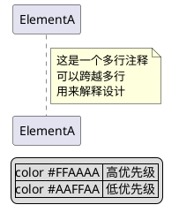

## PlantUML应用检查清单

使用PlantUML生成图表时，检查以下内容：

- [ ] **语法正确** - 图表能正常生成，没有语法错误
- [ ] **元素完整** - 所有关键元素都包含了
- [ ] **关系准确** - 关系和多重性标注正确
- [ ] **易于阅读** - 排版和颜色搭配合理
- [ ] **注释清晰** - 关键元素都有适当的注释
- [ ] **命名规范** - 所有元素使用清晰的名称
- [ ] **版本控制** - 图表源代码可版本控制
- [ ] **符合规范** - 遵循UML规范和4+1架构标准
- [ ] **导出格式** - 支持多种输出格式（PNG, SVG, PDF）
- [ ] **可维护性** - 修改和维护图表容易

## 常见问题

**Q: PlantUML支持中文吗？**
A: 支持，但需要配置合适的字体。建议使用SimSun或Microsoft YaHei字体。

**Q: 如何导出高质量的图表？**
A: 使用SVG格式获得矢量图，可以缩放而不失质量。PNG适合直接显示。

**Q: 如何在文档中集成PlantUML？**
A: 可以使用插件集成到Markdown、Confluence、GitLab等工具中。

**Q: 大图表如何处理？**
A: 分解成多个较小的图表，或使用!define进行模块化。

## 参考资源

- 官方网站：http://plantuml.com/
- 在线编辑器：http://www.plantuml.com/plantuml/uml/
- 官方文档：http://plantuml.com/guide

---

PlantUML的优势在于它的文本驱动特性，使得图表可以和代码一起进行版本控制和代码审查，这对于架构设计的长期维护至关重要。
