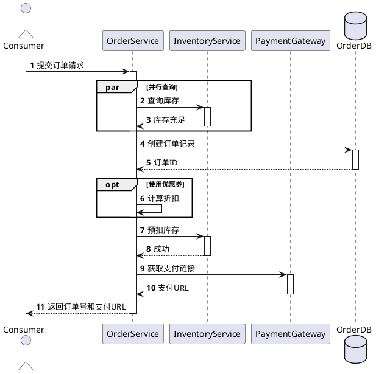

# 进程视图设计技能 (Process View Design Skill)

## 概述

进程视图描述系统在运行时的行为，包括并发、线程、进程间通信、性能特征等。进程视图关注的是"如何执行"而不是"是什么"，确保系统能够满足性能、可靠性等非功能需求。

## 核心概念

### 1. 并发模型 (Concurrency Model)

系统如何处理并发请求和并行处理。

**常见的并发模型**：

**1. 线程模型**：
```
┌─ 请求1 → 线程1 → 数据库 ┐
├─ 请求2 → 线程2 → 缓存  ├─→ 响应1
└─ 请求3 → 线程3 → 文件  ┘

线程池大小：CPU核心数的2-4倍
优点：简单，易于实现
缺点：内存消耗大，上下文切换开销
```

**2. 异步/非阻塞模型**：
```
┌─ 请求1 ─┐
├─ 请求2 ─┤─→ Event Loop ─→ 回调处理
└─ 请求3 ─┘

事件驱动，单线程或少数线程处理
优点：内存消耗小，吞吐量高
缺点：代码复杂，难以调试
```

**3. 协程/轻量级线程**：
```
Python asyncio, Go goroutines, Kotlin coroutines
可以创建数百万个并发单位
优点：高效，易于编程
缺点：运行时支持要求高
```

### 2. 同步和异步 (Synchronous vs Asynchronous)

**同步调用**：
```
调用者 ────→ 被调用者 ─→ 处理 ─→ 返回结果
         （阻塞等待）
```

特点：
- 简单易懂
- 实时性好
- 如果被调用者慢，调用者也会慢

**异步调用**：
```
调用者 ─→ 消息队列 ─→ 被调用者 ─→ 处理
     （立即返回）           ↓
                      处理完后通知调用者
```

特点：
- 解耦，提高吞吐量
- 难以保证顺序
- 难以处理失败情况

### 3. 关键路径分析 (Critical Path Analysis)

确定系统中影响性能最大的操作序列。

**示例 - 电商下单的关键路径**：
```
用户下单 ─→ 查询库存 ─→ 创建订单 ─→ 预扣库存 ─→ 返回
  10ms      100ms      50ms       100ms      10ms
                                           ─────────
                                           总耗时: 270ms

关键路径：查询库存 + 预扣库存 = 200ms
优化重点：减少这两个操作的时间
```

### 4. 非功能需求 (Non-Functional Requirements)

进程视图需要满足的性能、可靠性、可用性等要求。

**常见的非功能需求**：
- **响应时间** (Latency)：<500ms, <1s等
- **吞吐量** (Throughput)：QPS, TPS等
- **可用性** (Availability)：99.9%, 99.95%, 99.99%
- **一致性** (Consistency)：强一致、最终一致
- **可扩展性** (Scalability)：支持的最大并发数

## 设计流程

### Step 1：识别关键场景

从场景视图中选择需要详细分析的用例。

**选择标准**：
1. **性能关键** - 高并发的操作（查询、搜索）
2. **可靠性关键** - 不能失败的操作（支付、转账）
3. **复杂度高** - 多步骤、多参与者的操作

**示例 - 电商系统的关键场景**：
```
高优先级场景：
  1. 下单（高并发、性能关键）
  2. 支付（高可靠、不能失败）
  3. 库存查询（高并发、实时性强）

中优先级场景：
  4. 订单查询（较少并发）
  5. 退款处理（可靠性关键，频率低）

低优先级场景：
  6. 评价发表（高并发但对性能要求不高）
  7. 消息通知（异步非关键）
```

### Step 2：分析并发需求

对每个关键场景，分析系统需要处理的并发情况。

**并发分析方法**：
```
问题1：同时有多少用户执行该操作？
  答：日均100万订单，高峰时期100万/8小时 = 35/秒

问题2：哪些步骤可以并行执行？
  答：库存查询和用户信息查询可以并行

问题3：哪些步骤必须同步？
  答：库存扣减必须同步，避免超卖

问题4：数据一致性要求？
  答：库存必须强一致，订单可以最终一致
```

**并发分析示例 - 电商下单**：
```
假设：
  - 日均订单量：1000万
  - 工作时间：8小时
  - 平均QPS：1000万/8小时 = 347/秒
  - 高峰时期：高出平均值5倍 = 1735/秒
  - 单个请求的处理时间：100ms

所需的并发处理能力：
  - 最少线程数：1735 * 0.1秒 = 174个线程
  - 考虑安全系数：200-300个线程
  - 如果使用连接池：每个线程1个数据库连接
    → 需要200-300个数据库连接
```

### Step 3：设计序列图

使用PlantUML绘制关键场景的序列图，展示各个参与者之间的交互顺序。

**序列图的要素**：
- **参与者** (Actor)：系统内部的组件或外部系统
- **消息** (Message)：同步调用、异步调用、返回值
- **执行条件** (Condition)：if-then-else
- **循环** (Loop)：重复执行
- **并行** (Parallel)：多个操作同时进行

**PlantUML序列图模板 - 下单场景**：


### Step 4：设计活动图

对于复杂的流程，使用活动图展示各个步骤、分支和同步点。

**活动图用于表示**：
- 多步骤的业务流程
- 分支和决策点
- 并行活动
- 同步点和合并

**PlantUML活动图模板 - 支付流程**：
```plantuml
@startuml
start
:用户进入支付页面;
:显示支付方式选项;
if (用户选择支付方式) then (支付宝)
  :调用支付宝API;
  :用户授权;
  :支付宝返回结果;
else (微信)
  :调用微信API;
  :用户授权;
  :微信返回结果;
else (银行卡)
  :调用银行API;
  :用户输入卡号;
  :银行返回结果;
endif

if (支付成功?) then (是)
  :更新订单状态为已支付;
  :发送确认邮件;
  :显示支付成功页面;
else (否)
  :显示支付失败页面;
  :记录日志;
  :提示重试;
endif
stop
@enduml
```

### Step 5：识别进程和线程

确定系统需要的并发单位和通信机制。

**进程/线程的识别**：
```
Web应用场景：
  - 主线程：处理HTTP请求
  - 工作线程池：处理业务逻辑（大小：CPU核心数的2-4倍）
  - 后台线程：处理定时任务、异步操作
  - 数据库连接池：管理数据库连接

消息队列场景：
  - 生产者线程：发送消息
  - 消费者线程：消费消息，处理任务
  - 处理线程：执行具体的业务操作
```

### Step 6：设计通信机制

确定进程/线程之间如何通信。

**通信机制选择**：

**1. 同步调用（RPC/HTTP）**：
```
优点：
  - 简单直接
  - 实时性好
  - 容易实现

缺点：
  - 耦合强
  - 如果被调用者慢，调用者也会慢
  - 不好做负载均衡

适用场景：
  - 响应时间要求低
  - 查询操作
  - 内部调用
```

**2. 异步消息（消息队列）**：
```
优点：
  - 解耦
  - 吞吐量高
  - 便于扩展

缺点：
  - 代码复杂
  - 不保证顺序（有些MQ保证）
  - 难以处理失败

适用场景：
  - 非实时操作
  - 高并发操作
  - 跨系统通信
  - 异步通知

示例：
  订单服务 ─→ 消息队列 ─→ 库存服务
  订单服务 ─→ 消息队列 ─→ 积分服务
  订单服务 ─→ 消息队列 ─→ 推送服务
```

**3. 事件驱动**：
```
优点：
  - 高度解耦
  - 容易添加新的消费者

缺点：
  - 难以追踪事件流
  - 调试困难

实现示例：
  public class OrderService {
    public void placeOrder(Order order) {
      order.create();
      eventBus.publish(new OrderCreatedEvent(order));
    }
  }

  @EventListener
  public void onOrderCreated(OrderCreatedEvent event) {
    inventoryService.reserveInventory(event.getOrder());
  }
```

### Step 7：识别性能瓶颈

分析关键路径，找出影响性能的操作。

**瓶颈识别方法**：
```
1. 分析每个操作的耗时
   - 数据库查询：100ms
   - API调用：500ms
   - 计算处理：10ms

2. 识别串行的关键路径
   - 下单 → 查询库存(100ms) → 创建订单(50ms) → 预扣库存(100ms) = 250ms

3. 找出可以优化的地方
   - 查询库存 + 预扣库存 = 200ms（最大瓶颈）
   - 可以加缓存减少查询时间

4. 优化建议
   - 使用缓存：库存查询 → 10ms
   - 异步处理：预扣库存 → 异步，不阻塞主流程
   - 优化数据库：添加索引、优化SQL
```

### Step 8：设计可靠性机制

确保系统在出现故障时能够恢复。

**可靠性设计模式**：

**1. 重试机制**：
```
operation() {
  for (int i = 0; i < MAX_RETRIES; i++) {
    try {
      return doOperation();
    } catch (TemporaryException e) {
      if (i == MAX_RETRIES - 1) throw e;
      sleep(exponentialBackoff(i));  // 指数退避
    }
  }
}
```

**2. 超时机制**：
```
timeout = 5秒
try {
  result = service.callWithTimeout(5000);
} catch (TimeoutException e) {
  // 处理超时
  return defaultValue();
}
```

**3. 熔断器 (Circuit Breaker)**：
```
状态机：
  正常 ─[失败次数>阈值]→ 开启 ─[超时期后]→ 半开 ─[成功]→ 正常
                                      ↓[失败]
                                      开启

作用：
  - 快速失败
  - 避免级联故障
  - 给系统恢复时间
```

**4. 补偿事务**：
```
正向流程：
  1. 创建订单 (成功)
  2. 扣库存 (成功)
  3. 扣账户余额 (失败!)

补偿流程：
  3. 失败，需要回滚
  2. 恢复库存
  1. 取消订单
```

## 性能优化技巧

### 1. 缓存策略

**缓存分层**：
```
请求 ↓
  本地缓存 (1ms)
    ↓ miss
  分布式缓存 (10ms)
    ↓ miss
  数据库 (100ms)
```

### 2. 异步处理

**不需要实时结果的操作改为异步**：
```
❌ 同步：用户等待邮件发送完成
✅ 异步：用户立即返回，邮件在后台发送
```

### 3. 批量操作

**减少数据库往返**：
```
❌ 循环：for each item { insert(item); }  // N次查询
✅ 批量：insertBatch(items);  // 1次查询
```

### 4. 连接池优化

```
最小连接数：核心并发线程数
最大连接数：峰值并发线程数 + 缓冲
超时时间：根据平均查询时间设置
```

## 进程视图验证清单

进程视图设计完成后，验证以下内容：

- [ ] **关键场景完整** - 所有关键场景都有对应的流程
- [ ] **并发清晰** - 并发模型清晰定义
- [ ] **通信机制明确** - 进程间的通信方式清晰
- [ ] **同步点标记** - 需要同步的地方清晰标记
- [ ] **异常处理** - 异常和失败情况都有处理
- [ ] **性能指标** - 非功能需求清晰定义
- [ ] **流程完整** - 序列图完整正确
- [ ] **活动清晰** - 活动图清晰易懂
- [ ] **无死锁** - 没有可能的死锁情况
- [ ] **可扩展** - 设计支持预期的并发量
- [ ] **可靠性** - 有完善的故障处理机制
- [ ] **性能满足** - 关键路径的性能指标满足需求

## 参考资源

- `docs/4plus1-plugin-implementation-plan.md` - 实施计划
- `agents/process-view-architect.md` - 进程视图架构师Agent
- `skills/plantuml-best-practices/SKILL.md` - PlantUML最佳实践
- `assets/examples/ecommerce-system/4-process-view.plantuml` - 电商平台进程视图示例

---

进程视图设计直接影响系统的性能和可靠性，务必充分分析并发需求和性能指标，确保设计能够支持实际的业务负载。
