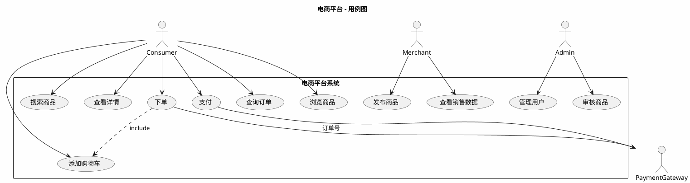

# 场景视图设计技能 (Scenario View Design Skill)

## 概述

场景视图是4+1架构的第一个视图，也是最重要的视图。它从用户和利益相关者的角度描述系统的功能需求，包括关键场景、用例、非功能需求等。场景视图作为其他视图的驱动，确保架构设计满足实际的业务需求。

## 核心概念

### 1. 用例 (Use Case)

用例是指系统与外部参与者之间完成的一个有意义的业务流程。

**用例的三要素**：
- **参与者** (Actor)：与系统交互的外部实体（用户、系统、外部服务）
- **前置条件** (Preconditions)：用例执行前系统必须满足的条件
- **流程** (Flow)：参与者与系统交互的步骤序列

**示例 - 电商平台的用例**：
```
用例名称：消费者下单
参与者：消费者、系统、支付网关
前置条件：消费者已登录，商品库存充足
主流程：
  1. 消费者浏览商品
  2. 消费者添加商品到购物车
  3. 消费者提交订单
  4. 系统扣减库存
  5. 系统生成订单
  6. 消费者前往支付
```

### 2. 场景 (Scenario)

场景是用例的一个具体实例，描述系统在特定条件下的行为。包括主流程场景和替代场景。

**场景分类**：
- **主流程** (Main Flow)：正常情况下的执行路径
- **替代场景** (Alternative Flow)：系统的可选执行路径
- **异常场景** (Exception Flow)：系统出现错误或异常时的处理

**示例**：
```
场景1：消费者成功下单
  - 正常的支付流程
  - 订单创建成功

场景2：消费者取消订单
  - 在支付前取消
  - 库存恢复

场景3：库存不足
  - 用户选择商品后库存被其他用户买完
  - 提示用户库存不足
```

### 3. 非功能需求 (Non-Functional Requirements)

系统必须满足的性能、可靠性、安全性等方面的要求。

**主要类型**：
- **性能需求** (Performance)：响应时间、吞吐量、延迟等
- **可用性** (Availability)：系统可用率，如99.9%、99.99%
- **可扩展性** (Scalability)：支持的并发用户数、数据量增长
- **安全性** (Security)：认证、授权、加密等
- **可靠性** (Reliability)：错误恢复、故障转移

**示例 - 电商平台的非功能需求**：
```
性能：
  - 查询商品：<500ms
  - 下单：<1s
  - 搜索：<200ms

可用性：
  - 全年可用率：99.95%

可扩展性：
  - 支持100万并发用户
  - 日均订单量：1亿

安全性：
  - 用户密码加密存储
  - 支付信息PCI合规
```

### 4. 用例图 (Use Case Diagram)

用PlantUML绘制的用例图，展示参与者、用例和它们之间的关系。

## 设计流程

### Step 1：确定系统边界和参与者

**关键问题**：
1. 系统要解决什么问题？
2. 谁会使用这个系统（参与者）？
3. 系统与外部世界如何交互？

**参与者识别**：
- 最终用户（消费者、商家、管理员）
- 外部系统（支付网关、物流系统、邮件服务）
- 定时任务（批处理、清理任务）

**示例 - 电商平台的参与者**：
```
直接参与者：
  - 消费者
  - 商家
  - 平台运营管理员
  - 仓库管理员

外部系统参与者：
  - 支付网关
  - 物流系统
  - 发票系统
```

### Step 2：识别用例

从参与者的角度出发，识别系统需要提供的功能。

**识别方法**：
1. 列出每个参与者想从系统获得什么
2. 分组相关的功能成为用例
3. 验证用例是否有明确的开始和结束

**用例识别技巧**：
- 使用动词来描述用例（浏览、搜索、下单、支付）
- 一个用例应该代表一个有意义的业务流程
- 避免用例过大或过小

**示例 - 电商平台的用例清单**：
```
消费者用例：
  - 注册账户
  - 浏览商品
  - 搜索商品
  - 查看商品详情
  - 添加到购物车
  - 结算订单
  - 支付订单
  - 查询订单状态
  - 申请退款
  - 评价商品

商家用例：
  - 发布商品
  - 管理商品信息
  - 查看订单
  - 发货
  - 查看销售数据

管理员用例：
  - 管理用户账户
  - 审核商品
  - 处理投诉
  - 查看系统数据
```

### Step 3：定义关键用例的详细流程

选择业务关键的、复杂的、高频的用例，编写详细的流程描述。

**流程描述模板**：
```
用例名称：[清晰的用例名]
优先级：[高/中/低]
参与者：[主参与者]/[次参与者]
前置条件：[用例执行前的状态]
主流程：
  1. [参与者行动]
  2. [系统响应]
  3. ...
替代流程A（条件）：
  1. ...
异常处理：
  - [异常情况]：[系统处理方式]
非功能需求：
  - 响应时间：[时间要求]
  - 并发：[并发要求]
```

**电商下单用例详细定义**：
```
用例名称：消费者下单
优先级：高
参与者：消费者/支付系统/库存系统
前置条件：消费者已登录，商品已添加到购物车
主流程：
  1. 消费者进入结算页面
  2. 系统显示购物车中的商品列表
  3. 消费者输入收货地址
  4. 消费者选择配送方式
  5. 系统计算运费
  6. 系统显示订单总额
  7. 消费者确认订单
  8. 系统创建订单（状态：待支付）
  9. 系统预扣库存
  10. 系统返回订单号和支付链接
替代流程A（优惠券）：
  5a. 消费者输入优惠券
  5b. 系统验证优惠券有效性
  5c. 系统应用折扣
替代流程B（取消订单）：
  7a. 消费者点击取消
  7b. 系统删除待支付订单
  7c. 释放预扣库存
异常处理：
  - 库存不足：提示用户，允许减少数量或选择缺货提醒
  - 地址无效：提示用户重新输入
  - 优惠券失效：提示用户优惠券已过期
非功能需求：
  - 响应时间：<1秒
  - 并发量：支持10万QPS
```

### Step 4：定义关键场景

为每个关键用例的主流程和重要的替代场景编写详细的场景描述。

**场景描述要点**：
- 清晰的初始状态
- 详细的交互步骤
- 明确的结束状态
- 可能的异常处理

### Step 5：识别关键的非功能需求

从业务和技术角度，确定系统必须满足的非功能需求。

**分析方法**：
1. **性能需求**：分析关键场景的响应时间、吞吐量要求
2. **可用性需求**：根据业务重要性定义可用率
3. **可扩展性需求**：预测未来的增长和并发量
4. **安全需求**：确定敏感数据的保护方式

**示例 - 非功能需求优先级**：
```
支付流程：
  可靠性 > 性能 > 可用性
  （支付必须可靠，不能出错；性能其次；可用性第三）

商品搜索：
  性能 > 可用性 > 可靠性
  （用户期望快速搜索结果；宁愿临时不可用也不愿慢速搜索）

用户账户管理：
  安全性 > 可靠性 > 性能
  （安全第一，数据不能丢失，速度其次）
```

### Step 6：绘制用例图

使用PlantUML创建用例图，展示参与者、用例和系统边界。

**PlantUML用例图模板**：


### Step 7：验证和完善

**验证清单**：
- 是否覆盖了所有主要参与者的需求？
- 是否有明确的系统边界？
- 用例是否相对独立和可测试？
- 非功能需求是否清晰可测量？
- 用例图是否完整和易于理解？

## 最佳实践

### DO's ✅

1. **从业务角度出发**
   - 专注于用户的实际需求，而不是技术实现
   - 使用业务术语而不是技术术语
   - 参与业务人员讨论以获得精确需求

2. **写出可测试的场景**
   - 每个场景应该有明确的成功标准
   - 包括异常和边界情况
   - 清晰描述"完成"的定义

3. **优先级排序**
   - 区分关键、重要、普通用例
   - 优先设计关键用例的详细流程
   - 为高风险的用例做详细的非功能需求分析

4. **跨职能协作**
   - 与产品、技术、运维团队讨论需求
   - 获得各方对用例和非功能需求的同意
   - 记录关键的决策和权衡

### DON'Ts ❌

1. ❌ **过度细节**
   - 不要描述用户界面的每个像素
   - 不要包含实现细节
   - 用例应该专注于功能，而不是外观

2. ❌ **混淆用例和场景**
   - 一个用例可以有多个场景
   - 用例是抽象的业务流程
   - 场景是具体的执行路径

3. ❌ **忽视非功能需求**
   - 非功能需求同样重要，甚至更重要
   - 性能、安全、可用性需求应该明确
   - 应该能够被测试和验证

4. ❌ **用例过大**
   - 一个用例不应该涵盖多个业务流程
   - 如果用例描述过长（>20步），需要分解
   - 保持用例相对独立和可测试

## 常见用例陷阱

### 1. 登录用例的处理

**错误方式**：
```
用例：登录
流程：
  1. 用户输入用户名和密码
  2. 系统检查用户名和密码
  3. 用户登录成功
```

**正确方式**：
```
用例：身份验证
参与者：用户/身份验证系统
前置条件：用户已注册
主流程：
  1. 系统显示登录页面
  2. 用户输入凭证
  3. 系统验证凭证
  4. 系统创建会话
  5. 系统显示首页
替代流程A（忘记密码）：
  3a. 凭证不匹配
  3b. 用户请求重置密码
异常处理：
  - 用户不存在：提示用户名不正确
  - 多次失败：锁定账户，发送安全警告
```

### 2. 数据初始化的处理

**错误方式**：
```
用例：初始化数据
```

**正确方式**：
```
用例是用户操作，不是系统初始化
系统初始化应该在系统约束中描述，而不是用例
```

### 3. 细粒度的CRUD操作

**错误方式**：创建、更新、删除分别作为用例

**正确方式**：
```
用例：管理商品
流程：
  1. 商家进入商品管理界面
  2. 商家可以创建、编辑或删除商品
  3. 系统保存更改
```

## 用例编写模板

```
---
ID: UC-001
名称: [清晰、简洁的用例名]
优先级: ⭐⭐⭐ [高/中/低]
状态: [草稿/审批中/已确认]
参与者:
  - 主参与者: [用户类型]
  - 次参与者: [其他用户/系统]
前置条件: [用例执行的初始条件]
后置条件: [用例完成后系统的状态]

## 主流程 (Main Success Scenario)
1. [参与者首先启动该用例的初始事件]
2. [系统响应]
3. [参与者/系统进一步交互]
...
N. [用例以何种方式结束]

## 替代流程 (Alternative Flows)
### 流程A [名称]: [触发条件]
A1. [步骤]
A2. [步骤]
...
AM. [回到主流程的第X步]

## 异常流程 (Exception Flows)
- [异常情况]: [系统处理方式]
- [异常情况]: [系统处理方式]

## 非功能需求
- 响应时间: [要求]
- 并发: [要求]
- 可用性: [要求]
- 安全: [要求]

## 备注
[任何重要的背景信息或约束]
---
```

## 电商平台完整用例示例

### UC-001: 消费者注册

```
ID: UC-001
名称: 消费者注册账户
优先级: ⭐⭐ 中
参与者: 消费者/邮件服务
前置条件: 消费者未登录
主流程:
  1. 消费者进入注册页面
  2. 消费者输入邮箱
  3. 系统检查邮箱是否已注册
  4. 消费者输入密码
  5. 消费者确认密码
  6. 消费者勾选服务协议
  7. 消费者点击注册
  8. 系统创建账户
  9. 系统发送验证邮件
  10. 系统显示验证提示
替代流程A (已有账户):
  3a. 邮箱已注册
  3b. 系统提示邮箱已使用
  3c. 推荐用户登录或使用其他邮箱
异常处理:
  - 邮箱格式错误: 提示用户格式不正确
  - 密码过于简单: 提示密码强度要求
  - 服务协议未勾选: 禁用注册按钮
非功能需求:
  - 响应时间: <2秒
  - 可用性: 99.9%
  - 安全: 密码加密存储，发送验证邮件
```

### UC-002: 消费者下单

```
ID: UC-002
名称: 消费者下单
优先级: ⭐⭐⭐ 高
参与者: 消费者/支付系统/库存系统
前置条件: 消费者已登录，购物车不为空
主流程:
  1. 消费者进入购物车
  2. 系统显示购物车商品清单
  3. 消费者输入收货地址
  4. 消费者选择配送方式
  5. 系统计算运费
  6. 消费者查看订单总额
  7. 消费者确认订单
  8. 系统验证库存
  9. 系统预扣库存
  10. 系统创建订单（状态: 待支付）
  11. 系统生成支付链接
  12. 系统返回订单号给消费者
替代流程A (使用优惠券):
  5a. 消费者输入优惠券代码
  5b. 系统验证优惠券
  5c. 系统应用优惠
  5d. 系统重新计算总额
替代流程B (保存地址):
  3a. 消费者选择保存地址
  3b. 系统保存地址到账户
替代流程C (取消订单):
  7a. 消费者点击取消
  7b. 系统清空购物车
  7c. 返回商品列表页面
异常处理:
  - 库存不足: 提示用户库存不足，建议缺货提醒
  - 地址无效: 提示用户重新输入
  - 优惠券无效: 提示用户优惠券已过期或不适用
  - 配送不可达: 提示用户该地址无法配送
非功能需求:
  - 响应时间: <1秒
  - 并发量: 支持10万QPS
  - 可用性: 99.95%
  - 库存一致性: 不能超卖
  - 订单数据: 必须持久化
```

## 场景视图验证清单

场景视图设计完成后，验证以下内容：

- [ ] **参与者完整** - 所有主要参与者都已识别
- [ ] **用例完整** - 覆盖了系统的所有关键功能
- [ ] **用例清晰** - 每个用例都有明确的开始和结束
- [ ] **关键场景** - 高优先级用例有详细的场景描述
- [ ] **非功能需求** - 清晰定义了性能、可用性等需求
- [ ] **用例独立** - 用例相对独立，不相互包含
- [ ] **用例可测试** - 每个用例都可以被测试和验证
- [ ] **用例图正确** - PlantUML用例图符合规范
- [ ] **术语一致** - 所有地方使用一致的业务术语
- [ ] **完整性** - 没有遗漏的关键功能或场景

## 参考资源

- `docs/4plus1-plugin-implementation-plan.md` - 实施计划
- `agents/scenario-view-architect.md` - 场景视图架构师Agent
- `skills/plantuml-best-practices/SKILL.md` - PlantUML最佳实践
- `assets/examples/ecommerce-system/1-scenario-view.plantuml` - 电商平台用例图示例

---

场景视图是整个架构设计的基础，务必确保与利益相关者充分沟通，获得对需求和非功能需求的一致理解。
